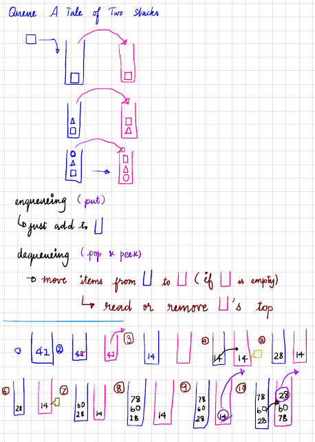

# Discussion

Consider the two stacks to be holding a different section of the queue at any given time with the following properties:

* Stack1 holds the oldest element on top
* Stack2 holds the newest element on top

### [Approach 1](https://github.com/div1090/codemonkeys/blob/master/Cracking%20the%20Coding%20Interview%20Challenges/Queues-%20A%20Tale%20of%20Two%20Stacks/soln.cpp)

* Push - Just add the element to Stack2 *unless both Stack1 & Stack2 are empty, in which case add to Stack1.*
* Pop - Remove the top from Stack1. If Stack2 is empty, then iteratively pop elements from Stack2 & push them to Stack1
* Front - Return the top element from Stack1

*Worst-case Time Complexities*:

*Push* : **O(1)**

*Pop* : **O(n)**

*Front* : **O(1)**

Pop operation takes **O(n)** because we might have to transfer the whole queue over from stack2 to stack1 in the worst case

### [Approach 2](https://github.com/div1090/codemonkeys/blob/master/Cracking%20the%20Coding%20Interview%20Challenges/Queues-%20A%20Tale%20of%20Two%20Stacks/soln.py)
Implement queue as two stacks - one stack contains items from old to new (top), and the other stack contains items in reverse order - new to old (top)

* Push - Just add to top of "old to new" stack, irrespective of status of either stack
* Pop - If "new to old" stack is not empty, pop the topmost element from this stack. If it is empty, iteratively pop items from "old to new" stack to "new to old" stack
* Peek - Similar to pop, but instead of popping from the topmost element of "new to old" stack, we just read from the top

Refer to the image for a pictorial explanation 

*Worst-case Time Complexities*:

*Push* : **O(1)**

*Pop* : **O(n)**

*Peek* : **O(n)**

Pop and Peek operation take **O(n)** because we might have to transfer the whole queue over from one stack to the other in the worst case

# [Question](https://www.hackerrank.com/challenges/ctci-queue-using-two-stacks/problem)

A queue is an abstract data type that maintains the order in which elements were added to it, allowing the oldest elements to be removed from the front and new elements to be added to the rear. This is called a First-In-First-Out (FIFO) data structure because the first element added to the queue (i.e., the one that has been waiting the longest) is always the first one to be removed.

A basic queue has the following operations:

*Enqueue* : add a new element to the end of the queue.

*Dequeue* : remove the element from the front of the queue and return it.

In this challenge, you must first implement a queue using two stacks. Then process  queries, where each query is one of the following  types:

1 x: Enqueue element  into the end of the queue.

2: Dequeue the element at the front of the queue.

3: Print the element at the front of the queue.

### Input Format

The first line contains a single integer, , denoting the number of queries.
Each line  of the  subsequent lines contains a single query in the form described in the problem statement above. All three queries start with an integer denoting the query , but only query  is followed by an additional space-separated value, , denoting the value to be enqueued.

It is guaranteed that a valid answer always exists for each query of type .

### Output Format

For each query of type , print the value of the element at the front of the queue on a new line.

#### Sample Input
```
10
1 42
2
1 14
3
1 28
3
1 60
1 78
2
2
```

#### Sample Output
```
14
14
```

Some equations and images don't render properly here, please visit the link above to view the full question properly.
